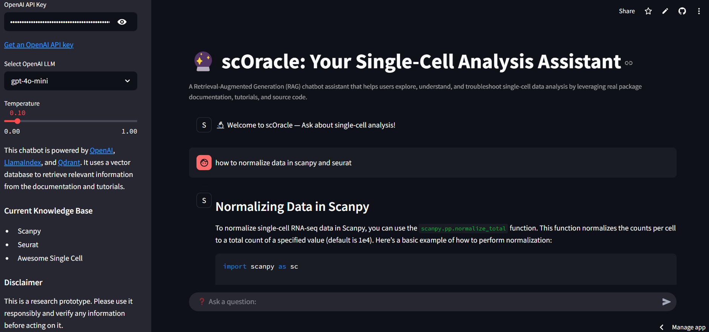
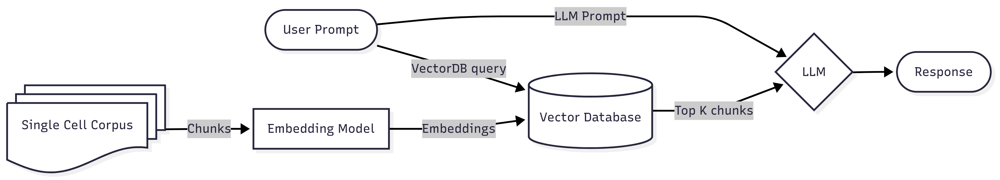

# 🔮 scOracle: An AI Assistant for Single-Cell Analysis

**scOracle** is a Retrieval-Augmented Generation (RAG) chatbot designed to answer questions about single-cell data analysis using LLM-powered search over curated documentation. It integrates tools like LlamaIndex, Qdrant, and Streamlit to deliver fast, context-aware assistance grounded in real-world biological tooling and workflows.

---

## Features
- **Target audience**: Scientists or students navigating single-cell workflows
- **Knowledge ingestion**: Parses real documentation, notebooks, and source code
- **Natural language interface**: Ask things like _“How do I run Leiden clustering?”_
- **Contextual output**: Offers code snippets, parameter insights, and troubleshooting tips
- **Modular backend**: Easily swap LLM models and parameters

Try it here: [https://scoracle-syc.streamlit.app](https://scoracle-syc.streamlit.app)  
>  Requires your own OpenAI API key for full functionality.

---

## App Architecture

## Knowledge Base Roadmap
- [X] Umbrella analysis framework: Scanpy & Seurat ==> MVP for first iteration
  - [ ] Can be extended to whole [scVerse ecosystem](https://scverse.org/)
- [ ] Upstream processing: Cell Ranger, Alevin-Fry, and NF-Core
- [ ] scATAC-seq analysis: Signac & ArchR
- [ ] Gene regulatory network inference: SCENIC & scPRINT
- [ ] Spatial Transcriptomics: squidpy
- [X] Awesome Single Cell [repo](https://github.com/seandavi/awesome-single-cell)

---

## Tech Stack

| Component    | Choice                    | Purpose                                                                 |
|--------------|----------------------------|-------------------------------------------------------------------------|
| **LLM API**   | GPT-4o mini                | Generates answers grounded in retrieved context                        |
| **Retrieval** | LlamaIndex                | Handles document parsing, chunking, indexing, and context retrieval    |
| **Embedding** | all-MiniLM-L6-v2 (SBERT)  | Converts text to dense vectors for semantic search                     |
| **Vector DB** | Qdrant                    | Stores and retrieves embeddings efficiently for fast RAG queries       |
| **UI**        | Streamlit                 | Provides a clean, interactive web interface                            |

---

## Future improvements for scOracle
1. **Scale up the knowledge base**  
   Expand to additional tools, methods, and modalities in single-cell analysis

2. **Improve document chunking**  
   Use smarter, context-aware splitters to preserve semantic boundaries

3. **Decouple backend/frontend**  
   Move LLM and vector logic to FastAPI, keeping Streamlit as a stateless client

4. **Optimize alignment**  
   Use adapter-based fine-tuning or embedding-level contrastive learning for better domain fit

---

## Implementation details
- [Part 1: Foundations](https://sychen9584.github.io/posts/2025/04/rag-part1/)
- [Part 2: Data Ingestion & Indexing](https://sychen9584.github.io/posts/2025/05/rag-part2/)
- [Part 3: CLI Query Engine](https://sychen9584.github.io/posts/2025/05/rag-part3/)
- [Part 4: Streamlit UI](https://sychen9584.github.io/posts/2025/05/rag-part4/)
- [Part 5: Scaling Up & Cloud Hosting](https://sychen9584.github.io/posts/2025/05/rag-part5/)

---